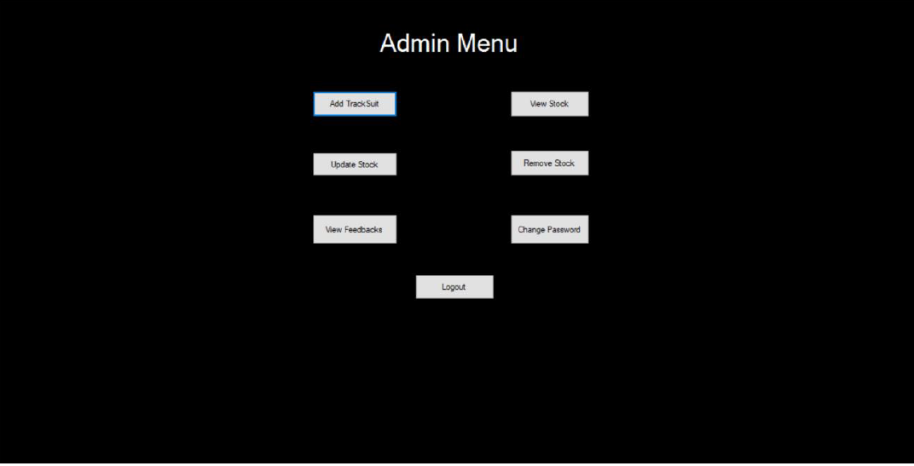

# NikeStore

**NikeStore** is a inventory management system developed in C# with MS SQL database integration . It provides a centralized platform for managing inventory, sales, customer relations, suppliers, and reporting, aimed at enhancing efficiency for both admin and customer users. This system follows Object-Oriented Programming (OOP) principles, including association, encapsulation, inheritance, and polymorphism. It is built using a 3-tier architecture consisting of BL, DL, UI.

## Table of Contents
- [Features](#features)
- [Screenshots](#screenshots)
- [Usage](#usage)
- [Documentation](#documentation)
- [Technologies Used](#technologies-used)
- [Contributing](#contributing)
- [License](#license)

## Features
- **3 tier model**: Business layer, Data layer and User Interface
- **Modular Design DLL Framework**: Backend business logic and data handling separated into a DLL framework, making it reusable and flexible for future UI developments.
- **User Authentication**: Distinct logins for admin, and customers.
- **Inventory Management**: Efficiently track, update, and manage product stock levels in real-time.
- **Sales Tracking**: View and analyze sales data .
- **Responsive Design**: A clean and modern interface that works well on various devices.

## Screenshots

## Usage
1. Clone the repository:
   `git clone https://github.com/miansaadtahir/fivestarhostel.git`
2. Navigate to the project directory:
   `cd FiveStarHostel/ HostelUI
/ Resistay/ bin/ debug`
3. Launch the `Resistay.exe` file.

## Documentation
For a detailed overview of the project and its features, visit the [Documentation](./documentation/) in the repository.

## Technologies Used
- C#
- MS SQL Server

## Contributing
Contributions, issues, and feature requests are welcome!  
Feel free to check out the [issues page](https://github.com/miansaadtahir/NikeStore/issues) for more information.

## License
Distributed under the MIT License. See [LICENSE](./LICENSE) for more details.
