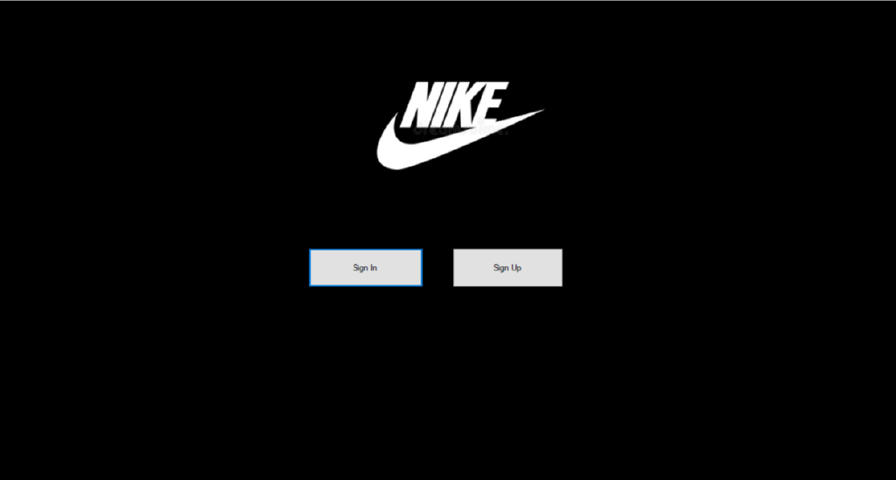
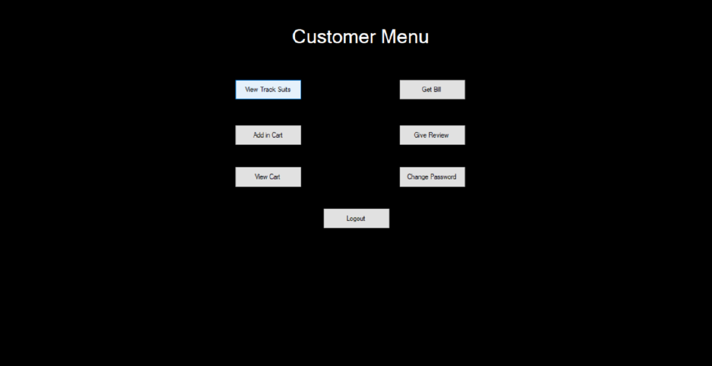
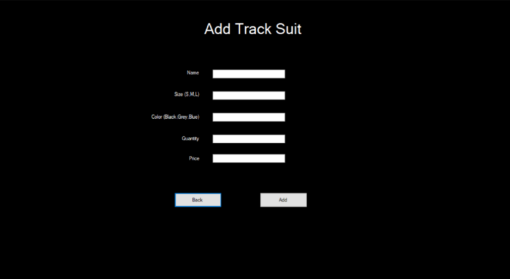
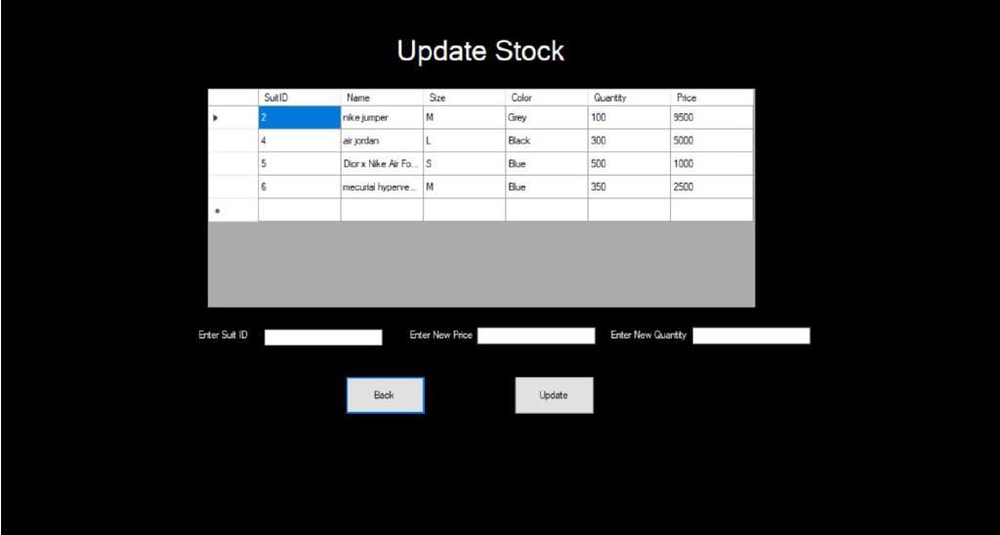

# Nike Store

A Window Form inventory management system developed in C# with MSSQL database integration . It provides a centralized platform for managing inventory, sales, and customer relations aimed at enhancing efficiency for both admin and customer users. This system follows Object-Oriented Programming (OOP) principles.

## Table of Contents
- [Features](#features)
- [Screenshots](#screenshots)
- [Usage](#usage)
- [Documentation](#documentation)
- [Technologies Used](#technologies-used)
- [Contributing](#contributing)

## Features
- Built on 3 tier model of Business layer, Data layer and User Interface.
- Backend business logic and data handling separated into a DLL framework, making it reusable and flexible for future UI developments.
- Distinct login system for admin, and customers.
- Efficiently track, update, and manage product stock levels in real-time.
- View and analyze sales data .
- A clean and modern interface that works well on various devices.

## Screenshots

## Usage
1. Clone the repository:
   `git clone https://github.com/miansaadtahir/NikeStore.git`
2. Navigate to:
   `cd .\NikeStore\script\`
3. Run the `nikeScript.sql` in SSMS
4. Navigate to the project directory:
   `cd .\NikeStore\NikeWinForm\bin\debug`
5. Launch the `NikeWinForm.exe` file.

## Documentation
For a detailed overview of the project and its features, visit the [Documentation](./documentation/) in the repository.

## Technologies Used
- C#
- Windows Forms
- MSSQL Database 

## Contributing
Contributions, issues, and feature requests are welcome!  
Feel free to check out the [issues page](https://github.com/miansaadtahir/NikeStore/issues) for more information.
